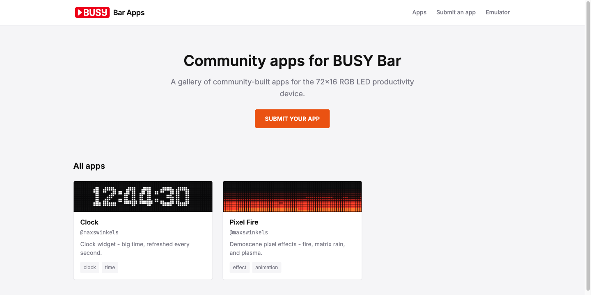

<p align="center">
  
</p>

<h1 align="center">BUSY Bar Apps</h1>

<p align="center">
  A community gallery of apps for the <code>BUSY Bar</code>.<br>
  Browse, grab the code, and share your own via pull request.
</p>

<p align="center">
  <a href="https://maxswinkels.github.io/busybar-apps/">Live gallery</a> &middot; <a href="#submit-your-app">Submit an app</a> &middot; <a href="CONTRIBUTING.md">CONTRIBUTING.md</a>
</p>

<p align="center">
  
  
  
  
</p>

<p align="center">
  
</p>

---

> [!IMPORTANT]
> **Unofficial community project.** Built and maintained by [Max Swinkels](https://github.com/maxswinkels), **not** an official Flipper Devices / BUSY product, and not affiliated with, endorsed by, or supported by them. "BUSY Bar" remains their trademark. For the real hardware and official apps, visit **[busy.app](https://busy.app)**.

## Why

- **Share working 72×16 apps.** The community gallery is a single place to browse and grab complete, tested applications.
- **Every app is one self-contained file that drives the bar directly.** Stdlib-only Python talking straight to the BUSY Bar HTTP API — over USB the bar is always at `10.0.4.20`, so `python app.py` just works. The same file runs unchanged against the emulator (`--host 127.0.0.1:8080`).
- **Pull request CI validates every submission.** The site's build checks your manifest schema, so there are no surprises when your PR lands.

## Browse apps

Visit the [live gallery](https://maxswinkels.github.io/busybar-apps/) to browse community apps. Each app page shows:

- **Preview image** of the app on the 72×16 LED display
- **Full source code** with syntax highlighting and a copy-to-clipboard button
- **Manifest metadata** (author, description, tags) and links to the app folder on GitHub

## Submit your app

1. **Fork** this repository
2. **Create** `apps/<your-slug>/` with:
   - `app.py`: your app (a single self-contained file, stdlib only)
   - `manifest.yaml`: metadata
   - `preview.png` or `preview.gif`: 720×160 screenshot
3. **Open a pull request** (use the checklist in the PR template)
4. **CI validates** your manifest schema; fix any errors and push again

See [CONTRIBUTING.md](CONTRIBUTING.md) for detailed instructions, app conventions, and the manifest schema.

### Example manifest

```yaml
name: Clock
author: maxswinkels
description: Clock widget - big time, refreshed every second.
tags:
  - clock
  - time
preview: ./preview.png
```

## Local development

Build and test the gallery locally:

```bash
npm install
npm run dev       # Dev server on localhost:3000
npm run build     # Static build to dist/
```

The site uses [Astro](https://astro.build) content collections to validate every app's manifest against a schema.

## Related projects

- **[busybar-emulator](https://github.com/maxswinkels/busybar-emulator)**: build and test apps locally with a faithful HTTP API, fonts, and pixel-perfect rendering
- **[busy.app](https://busy.app)**: the real hardware and official apps from Flipper Devices

## License

Code is [MIT](LICENSE). All apps in this gallery are submitted under MIT (license badge appears on submission).

"BUSY Bar" is a trademark of Flipper Devices. This project is unaffiliated and unofficial.
